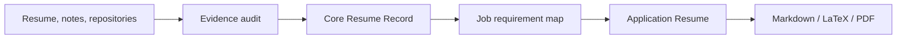

<div align="center">

# ResumeReviewer

**Build one truthful career record. Tailor every application without inventing evidence.**

[](resume-reviewer/SKILL.md)
[](#two-resume-modes)
[](#editable-latex-output)
[](#what-it-does)

**English** · [简体中文](README.zh-CN.md)

</div>

ResumeReviewer is an evidence-first Codex skill for US technology resumes. It assesses existing resumes, turns scattered source material into a factual Core Resume Record, and builds job-specific Application Resumes from verified evidence only.

> One source of truth for career facts; one focused resume for each application.

**[Quick start](#quick-start-30-seconds) · [Workflow](#how-it-works) · [Capabilities](#what-it-does) · [Resume modes](#two-resume-modes) · [LaTeX](#editable-latex-output) · [Rules](#opinionated-project-rules)**

## Quick start (30 seconds)

Ask Codex to install skill directly from GitHub:

```text
Use $skill-installer to install https://github.com/weeelin98/ResumeReviewer/tree/main/resume-reviewer
```

Start with one of these prompts:

```text
Use $resume-reviewer to assess this resume without rewriting it yet.
```

```text
Use $resume-reviewer to build a verified Core Resume Record from my resume, notes, and repositories.
```

```text
Use $resume-reviewer to tailor my Core Resume Record to this job description and return editable LaTeX.
```

Skill becomes available on next Codex turn after installation.

<details>
<summary><strong>Alternative installation methods</strong></summary>

### Bundled installer

```bash
python3 "${CODEX_HOME:-$HOME/.codex}/skills/.system/skill-installer/scripts/install-skill-from-github.py" \
  --repo weeelin98/ResumeReviewer \
  --path resume-reviewer
```

Installer places skill at `${CODEX_HOME:-$HOME/.codex}/skills/resume-reviewer`. Existing destination must be moved or removed before reinstalling.

### Development checkout

Use a symbolic link when local `git pull` updates should become available without reinstalling:

```bash
git clone https://github.com/weeelin98/ResumeReviewer.git
ln -s "$(pwd)/ResumeReviewer/resume-reviewer" "${CODEX_HOME:-$HOME/.codex}/skills/resume-reviewer"
```

Create link only when destination does not already exist. Start a new Codex turn after installing or updating skill.

</details>

## How it works



Core Resume Record remains factual source of truth. Each Application Resume is a separate selection optimized for one role, never a rewrite of source facts.

## What it does

| # | Capability | Result |
|---:|---|---|
| 1 | **Resume assessment** | Diagnoses ATS readability, evidence quality, relevance, wording, credibility, privacy, and layout without pretending to predict an objective ATS score. |
| 2 | **Resume rewriting** | Improves bullets, technical clarity, tense, and section structure while preserving source truth. |
| 3 | **Core Resume Record generation** | Converts resumes, notes, repositories, and candidate answers into `VERIFIED`, `NEEDS CONFIRMATION`, and `DO NOT USE` evidence. |
| 4 | **Application Resume generation** | Selects strongest verified evidence for one concise, reverse-chronological application. |
| 5 | **Job-description tailoring** | Maps requirements to proof as `DIRECT`, `ADJACENT`, or `GAP`. |
| 6 | **Role-competency mapping** | Extracts evidence for frontend, backend, full-stack, AI/ML, data, cloud/DevOps/SRE, mobile, product, and project/program roles. |
| 7 | **Credibility safeguards** | Blocks invented titles, dates, tools, metrics, users, ownership, deployments, and outcomes. |
| 8 | **Automated validation** | Checks Skills placement, articles, forbidden verbs, first-person language, filler, placeholders, bullet length, and repeated opening verbs. |
| 9 | **Editable LaTeX generation** | Produces reusable `.tex` source and PDF preview when a compatible compiler is available. |

## Two resume modes

| | Core Resume Record | Application Resume |
|---|---|---|
| **Purpose** | Preserve complete, truthful career evidence | Win consideration for one specific role |
| **Audience** | Candidate and resume agent | Recruiter, hiring manager, and ATS |
| **Scope** | All relevant verified history plus unresolved questions | Strongest job-relevant verified evidence only |
| **Length** | No one-page requirement | Concise; normally one page for interns and new grads |
| **Status** | `Not for Submission` | Application-ready after final audit |
| **Relationship** | Immutable factual source | Derived output; never changes Core facts |

### Application Resume defaults

- No Summary.
- No coursework.
- University/company left and city right.
- Degree/official title on second row and dates right.
- Exactly 3 bullets for every included Experience entry.
- 2–4 project bullets based on verified evidence.
- Skills at very end.

## Opinionated project rules

These repository-specific rules intentionally override generic resume conventions:

| Rule | Enforcement |
|---|---|
| Skills placement | `Skills` appears at very end. |
| English articles | Remove every standalone `a`, `an`, and `the` from resume prose. |
| Forbidden verbs | Never use `led`, `managed`, or `architected` in final resume content. |
| Tense | Use past tense for experience and project bullets. |
| Evidence | Never invent metrics, tools, dates, ownership, deployments, or outcomes. |
| Metrics | Use verified metrics without an artificial percentage cap; add baseline, timeframe, or scope when needed. |

## Editable LaTeX output

Template: [`resume-reviewer/assets/latex/application-resume.tex`](resume-reviewer/assets/latex/application-resume.tex)

Template uses ATS-readable single-column layout, one-line contact block, reusable resume macros, and Times New Roman when installed with TeX Gyre Termes fallback.

```bash
cp resume-reviewer/assets/latex/application-resume.tex application-resume.tex
xelatex application-resume.tex
```

Tectonic is also supported:

```bash
tectonic -X compile application-resume.tex
```

Copy template before adding personal information. Bundled asset must remain generic.

## Validate a Markdown resume

```bash
python3 resume-reviewer/scripts/validate_resume.py path/to/resume.md
```

Validator supplements human review; it cannot prove factual accuracy.

<details>
<summary><strong>Repository structure</strong></summary>

```text
resume-reviewer/
├── SKILL.md
├── agents/openai.yaml
├── assets/
│   └── latex/application-resume.tex
├── references/
│   ├── ats-and-layout.md
│   ├── evidence-and-car.md
│   ├── output-schema.md
│   ├── resume-templates.md
│   └── role-competencies.md
└── scripts/validate_resume.py
```

`resumeReviewer.json` remains a portable configuration for tools that do not load Codex skills.

</details>

## References

### Resume methodology

- Laura DeCarlo, *Resumes For Dummies*, 9th ed., John Wiley & Sons, 2026. Methodology adapted from chapters covering ATS, reverse chronology, Core and OnTarget resumes, CAR evidence, AI safeguards, resume language, new-graduate strategy, and final resume review.
- [OpenAI Developers: Codex use cases — Save workflows as skills](https://developers.openai.com/codex/use-cases). Used for Codex skill packaging direction.

### README presentation inspiration

- [mattpocock/skills](https://github.com/mattpocock/skills) — concise value proposition, fast installation path, and problem-to-solution organization.
- [akitaonrails/ai-memory](https://github.com/akitaonrails/ai-memory) — clear capability matrix, practical workflow explanation, and progressive technical detail.

This repository does not redistribute source book. Resume guidance cannot guarantee ATS ranking, interviews, or offers.
